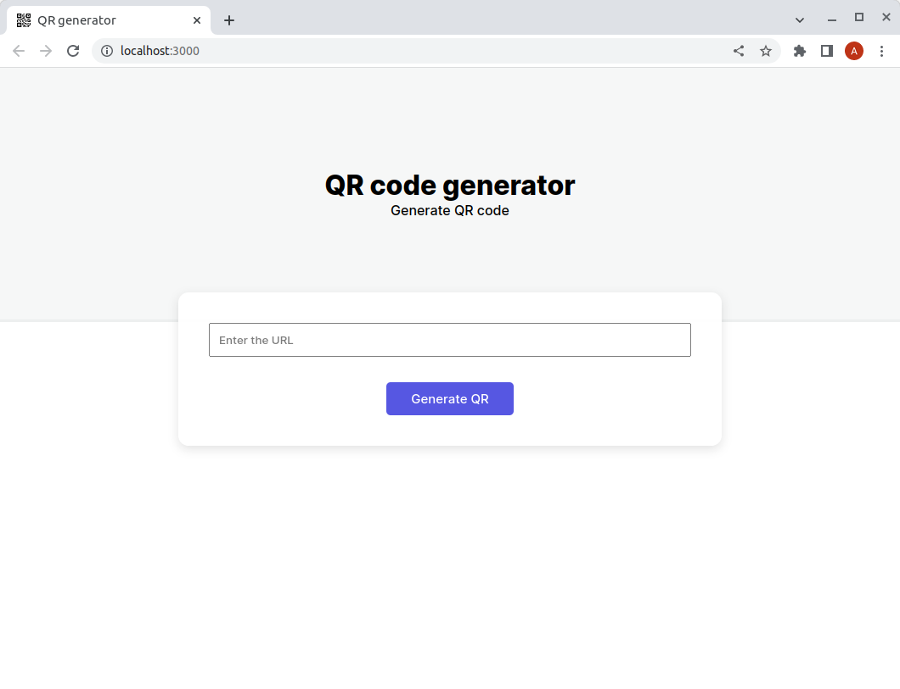
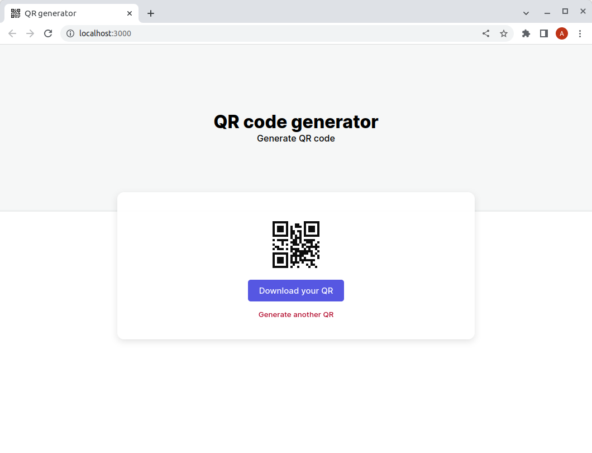

## QR code generator app
This app lets you generate QR code. Below are screen shots of it.

It also uses cypress as a testing library to test the application.

## Commands to run the application:

- Run application: `yarn start` or `npm start`
- Run cypress: `npx cypress open` or `yarn run cypress open`
# qr-code
